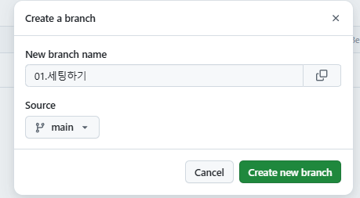

1. 설치
    1) Node.js 설치 - LTS 버전으로 설치하기

    2) vsCode에 워크스페이스 연결하고 react를 설치하기 
        ctrl + j 해서 `npm install -g create-react-app 하고`
                        `npx create-react-app 타이틀`

    3) 파일 셋팅(필요없는 파일 지우고 필요한거 생성)
        - public: (다음 파일들 빼고 다 삭제)favicon.ico, index.html, robots.txt 
                    기존 favicon.svg 유튜브꺼로 변경하기
                    index.html 내용물 변경
        - src: App.js, index.js 빼고 다 삭제(이 둘은 내용 변경)
                assets 폴더 생성하기
                README.md 파일 내용 변경
                .gitignore.json 파일 내용 변경 (프로젝트 하면서 git 에 올릴거임)

    4) rafce(리액트 자동완성) 하려면 확장프로그램 'EX7+ React/Redux/React-Native snippets' 설치하면 됨

2. 폴더 설명
    - node_modules: 프로젝트에서 사용하는 외부 라이브러리와 패키지들이 저장되는 곳입니다. 
                        개발에 필요한 도구와 코드를 더 쉽게 관리할 수 있게 도와줍니다.
    
    - public: 프로젝트의 공용 파일들이 저장되는 곳입니다. 
                주로 HTML 파일과 이미지 같은 정적인 파일들이 이곳에 위치하며, 이 파일들은 웹 브라우저에서 직접 접근할 수 있습니다.
            favicon.svg: 웹 사이트의 아이콘을 나타내는 이미지 파일입니다. 
                                웹 브라우저 탭에 표시되는 작은 아이콘을 설정할 수 있습니다.
            index.html: React 애플리케이션의 진입점인 HTML 파일입니다. 
                            브라우저에서 앱을 로드할 때 사용됩니다.
            robots.txt: 이 파일은 웹 사이트의 검색 엔진 크롤러에게 어떤 페이지를 검색할 수 있고 
                            어떤 페이지를 검색하지 말아야 하는지에 대한 지침을 제공하는 텍스트 파일입니다

    - src: 실제로 프로젝트의 소스 코드가 저장되는 곳입니다. 
                여기서 작성한 코드가 애플리케이션의 동작을 정의합니다.
            assets: 이미지나 폰트 등의 정적인 자원 파일들을 저장하는 폴더입니다.
            App.js: React 애플리케이션의 주요 컴포넌트인 App 컴포넌트의 코드가 들어있는 파일입니다. 이 파일에서 애플리케이션의 구조와 기능을 정의할 수 있습니다.
            index.js: React 애플리케이션의 진입점인 JavaScript 파일입니다. 이 파일에서 React 앱을 DOM에 렌더링하는 역할을 합니다.
    
    - .gitignore: Git 버전 관리에서 제외할 파일이나 폴더를 설정하는 파일입니다. 
                        node_modules와 같이 불필요한 파일들을 Git에 올리지 않도록 할 때 유용합니다.
    - package-lock.json: 패키지 의존성을 관리하기 위한 자동 생성된 파일입니다. 
                                이 파일은 패키지들의 버전 및 의존 관계를 정확하게 유지하기 위해 사용됩니다.
    - package.json: 프로젝트 설정과 의존성 정보를 담고 있는 파일입니다. 
                            프로젝트의 이름, 버전, 필요한 라이브러리 등을 정의할 수 있습니다.
    - README.md: 프로젝트에 대한 설명과 사용 방법을 기술하는 마크다운 파일입니다. 
                    다른 개발자들이 프로젝트를 이해하고 사용하는데 도움이 되는 정보를 작성할 수 있습니다. 

3. 필요한 프로그램(라이브러리) 설치하기
    (미리 설치하고 나중에 쓸때 설명할거임)
    - react를 설치합니다. `npx create-react-app 타이틀`
    
    - react-router-dom을 설치합니다. `npm install react-router-dom`
        (라우팅 및 페이지 네비게이션을 처리하기 위한 라이브러리)
    
    - axios를 설치합니다. `npm install axios`
        ( 웹 API와의 통신, 서버로 데이터 요청, RESTful API 호출 등에 사용. ajax 같은거임)
    
    - react-icons을 설치합니다. `npm install react-icons`
        ( 아이콘을 사용하기 위한 라이브러리 )
    
    - react-player를 설치합니다. `npm install react-player` 
        ( 비디오 및 오디오 소스를 재생하기 위한 라이브러리 )
    
    - sass를 설치합니다. `npm install sass` 
        ( CSS의 확장된 버전으로, 스타일시트를 보다 간결하고 유지보수하기 쉽게 작성할 수 있도록 도와주는 CSS 전처리기 )
    
    - react-helmet-async를 설치합니다. `npm install react-helmet-async` 
        ( 동적으로 웹 페이지의 헤더 메타데이터를 관리하기 위한 라이브러리)

    - swiper를 설치합니다. `npm install swiper` 
        (모바일 및 데스크톱 환경에서 사용할 수 있는 슬라이더 및 캐러셀 컴포넌트를 구현하는 JavaScript 라이브러리 )

	* 위에것들 한방에 설치 가능함
		npm install react-router-dom axios react-icons react-player sass react-helmet-async swiper 

3. 깃허브 연동
        1) 컴퓨터에 깃 설치하기
            크롬에서 'git' 검색해서 다운 받기

		1) 새 레포지토리 만들기(public 으로 생성)
            만들때 Readme 파일은 생성 안함으로 체크하기 
            
		2) 생성하면 나오는 페이지에서 
			"or create a new repository on the command line" 영역에 있는 명령문들 다 복사해서 터미널에 붙여넣기
				- git init  => 빈 Git repository가 다음 주소에 초기화 되었다는 의미이고 작업 디렉토리가 초기화됨을 의미.
									만약 Git 저장소가 이미 초기화되어 있다면 git init을 다시 실행할 필요는 없습니다.
				- git add README.md =>  "add" 명령어로 README.md파일을 스테이지 영역에 넘긴다는 의미
											git은 작업폴더 => 스테이징영역 => 레포지토리영역 으로 구분되어 있음
				- git commit -m "first commit" => commit 명령어는 변경된 기록들을 기록해줍니다.
                    * 주의: 만약 Author identity unknown 에러 나면 아래꺼 코드 넣어서 로그인 하면 됨
                                git config --global user.email "you@example.com"
                                git config --global user.name "Your Name"
                            하고 vsCode 껐다 켜기
                        (기존 연결 끊고 싶으면 'git remote remove origin' 이거 넣기)

				- git branch -M main => git에서는 기본 default로 repository를 만들면 branch를 master로 생성하게 됩니다.
											 하지만 git에서 이제 master가 아닌 main를 기본으로 사용하도록 합니다.
				- git remote add origin https://github.com/bitstudy/my_youtube.git => git remote 명령어는 원격 저장소를 관리하는 명령어 입니다. 위의 명령어를 통해 원격 저장소 주소를 origin이라는 이름으로 등록합니다
				- git push -u origin main =>  원격저장소에 변경된 commit을 즉 README.md 파일을 등록
														-u 플래그는 로컬 브랜치를 원격 브랜치와 연결하며, main 브랜치를 origin 리포지토리의 main 브랜치와 연결합니다.

		3) 2번 명령어들 실행하면 내가 1번에서 파일 지웠던것들도 다 올라가져있다. (git init 명령문 때문임)
			그래서 현재 내가 실제로 가지고 있는것들로 새로 push 를 해볼거다.
			- git add . => .은 모든 파일을 다 올리겠다는 뜻
			- git commit -m "첫 세팅 파일" => 현재 올리는 작업의 메세지는 "첫 세팅 파일" 로 할거임
			- git push -u origin main => 커밋한걸 main 브랜치와 연결 

        4) 브랜치 따기 
            깃허브의 레포지토리 가서 (왼쪽 상단 쪽에 있는) main 브런치 선택 해서 new branch 만들기
                => 01-세팅하기
    

4. SCSS 셋팅하기 
	SCSS 는 SASS의 다음 버전임, 약간의 문법 차이가 있지만 SCSS가 좀 더 넓은 범용성과 CSS의 호환성의 장점.
	큰 차이점은 SASS는 중첩으로 들여 쓰기를 사용하고 속성 구분은 줄 바꿈을 이용하지만, SCSS의 경우 중괄호로 중첩을 표현하고 세미콜론으로 속성을 구분함

		1) src > assets 안에 "fonts, img, scss" 폴더 생성
		2) scss 폴더 안에 "section, setting" 폴더랑 "style.scss" 파일 만들고
		3) setting 폴더 안에 "_common.scss, _fonts.scss, _mixin.scss, _reset.scss, _vars.scss" 파일 만들기
		  (_ 를 붙이는 이유는 다른파일(style.scss) 에서 사용한다는 뜻)

<!--  여기까지 하고 style.scss 가기  -->
 